<p align="center">
  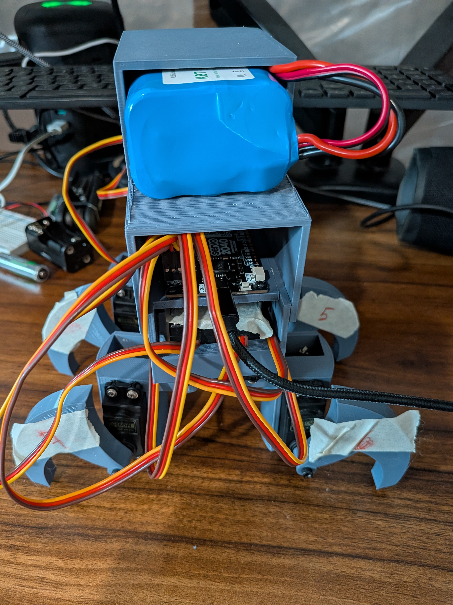
</p>

# Introduction

I have been trying, over several years, to develop a walking robot. I've come across many issues, from not enough servos to too many servos (and having a heavy robot that couldn't walk). This repository highlights the latest iteration of this walking robot (which, unfortunately, is still not successful, but has demonstrated some progress from previous iterations).

# Materials

The following materials need to be purchased for this walking robot (links included):

* [12V 5200mAh Battery (X1, $32.99 ea.)](https://www.amazon.com/KBT-5200mAh-Rechargeable-Replacement-Compatible/dp/B0C242DYT1/ref=sr_1_7?crid=1SIDJOUAQQIE8&dib=eyJ2IjoiMSJ9.6A_VA_8qcZroVXD4hbJG-_0zYHsfztkOuL_j0ZI-qVZ90qAFC3pD6ulImms8gsOluSv09c7E2UkUkAfOtg5ae5XctOkT6waX_H6I7cpZZVHjBornF08RjtB9Y06umyWruwKf0tWKJxI-95cVymsCEPRJSuEBwIOSYjAC6JxqDxNQfWa0c5tolPITw42kGHjWYQf4jIHa1VIvBFsTsKh1URHNKBJIWVgipW1xOpEBSAbN1YSQjgVpYk5lICj7d30b3omKCGwQFhlaXov5YLSx2Zy_6XYpxYl9xzKJ_VgvtaY.gubT1TkzdsS7j0zriC8-6xLCnk4GDlg6R8FMsayGwtU&dib_tag=se&keywords=kbt%2Blithium%2Bion%2Bbattery&qid=1750712377&sprefix=kbt%2Blithium%2Bion%2Bbatter%2Caps%2C124&sr=8-7&th=1)
* [MG995 Servo (X8, $31.98 total)](https://www.amazon.com/Deegoo-FPV-Servo-MG995-Metal-Gear/dp/B07NQJ1VZ2/ref=sr_1_6?crid=1LRVW3LG4KGXD&dib=eyJ2IjoiMSJ9.cY6Rczg-OlaZeR22jUS8vOk7vd9JDTpqytGHpfWNxOlzQFdnAyPecryWF9KDcFX2pL2ia-pAG7zC4S_txmg_kkIxSdgtMvAg5yYaYJXFxklBoDVtZkeQmMhHJeYMrFIZERKQjOgSn0kTTQoBDRdeNHMaPW0c1Y-ldS6d29fXGHAN4X-1OEOwR2qHJR3leqAmfDyGmyF0VcpU1VPgNbuj1m3jghHgpEpPwSluAZ7lHcDHbbXuN0xwk1KAV87xcVZwunwntDmgJEUvePrW3sspIzfqw44Cj5WJN4kLdVq3MMA.C5VbtW8-uepQ90Cg2UnQXSa3J9jt21Cqt-MqjfxltAM&dib_tag=se&keywords=mg995%2Bservo&qid=1750712406&sprefix=mg995%2Bservo%2Caps%2C133&sr=8-6&th=1)
* [Servo 2040 from Pimoroni (X1, $24 total)](https://shop.pimoroni.com/products/servo-2040?variant=39800591679571)

The total estimated cost of this walking robot is around **$88.97**, but that can fluctuate based on deals and other things. **Please note I do not include here the M3 x 8mm and M2 x 8mm hex screws that I will use; you need 16 of the M2 and 8 of the M3 screws.**

# Walking Bot Body

I designed the walking bot on OnShape and printed it using my Prusa Mini.

## CAD Model

Below you will see my CAD model for this walking robot.

<p align="center">
  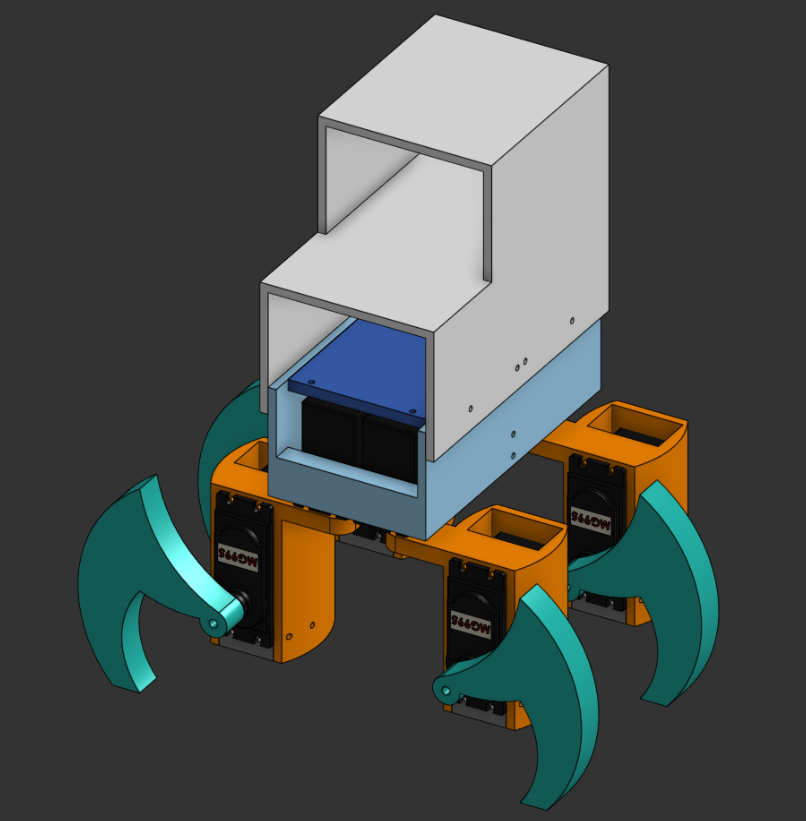
</p>

### Base of Walking Bot

The base of the walking bot is very important and one of my goals was to keep it as compact as possible. There is very little space between the four motors that drive each of the legs. In turn, this small base means two things:

* It is more stable that my previous designs, which were too heavy
* It is easier to print on my Prusa Mini and takes less time than previous bases

<p align="center">
  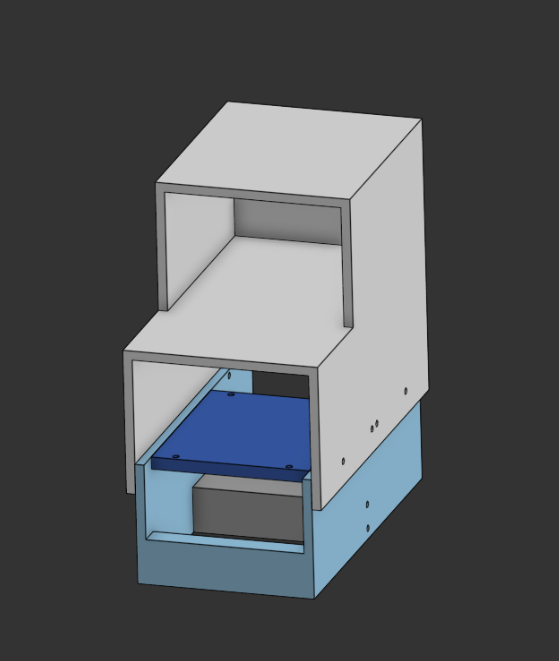
</p>

### Legs of Walking Bot

As for the next part, I have also made the legs smaller than previous iterations. There are two left-sided and two right-sided legs that need to be printed. The small part at the bottom is to hold the second motor in place for the leg, to which the "foot" of the walking bot will be attached. Below you will see the left- and right-sided legs.

<p align="center">
  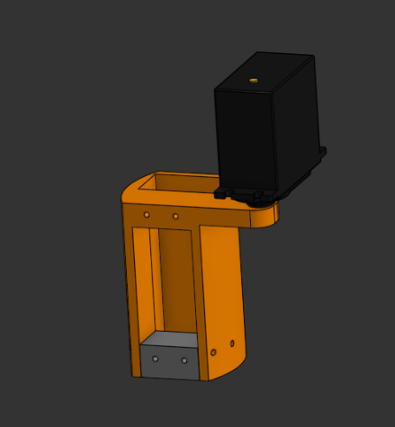
  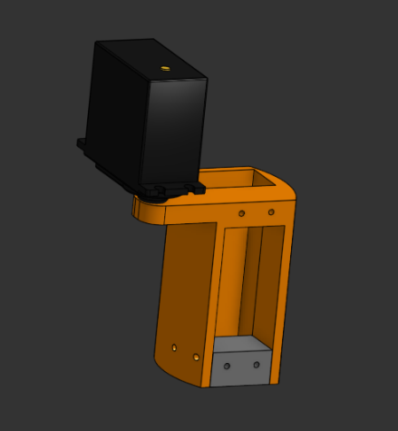
</p>

### Feet of Walking Bot

Lastly, I wish to show here the feet of the walking bot. In previous iterations, the surface area of the bottom of the foot was too small and made it difficult for the walking bot to have friction against other surfaces. I did make it also a bit aesthetic by making the wing-shaped design. Below you will see the left- and right-sided parts. In my actual build, do note that I decided to flip the motors so the gear connected to the foot is on the bottom, thereby increasing the height of the walking bot.

<p align="center">
  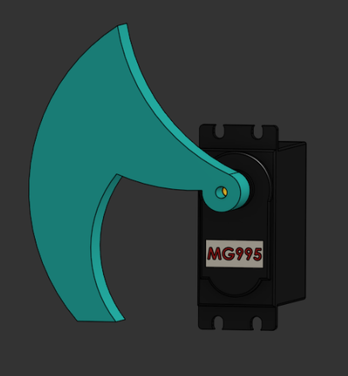
  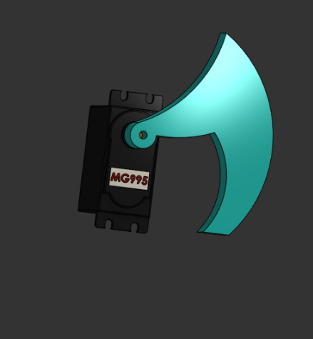
</p>

## Specifications & Material(s)
Below you can find the printer and material used.
## 3D Printer
Original Prusa Mini+
## Material(s)
* [Grey ANYCUBIC 1kg, 1.75mm Filament ($13.99)](https://www.amazon.com/dp/B0834W5L3L?ref_=ppx_hzsearch_conn_dt_b_fed_asin_title_3)
# Software
PrusaSlicer

<p align="center">
  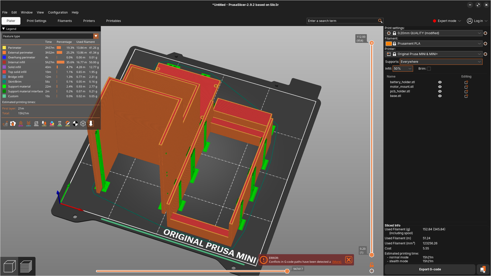
</p>

<p align="center">
  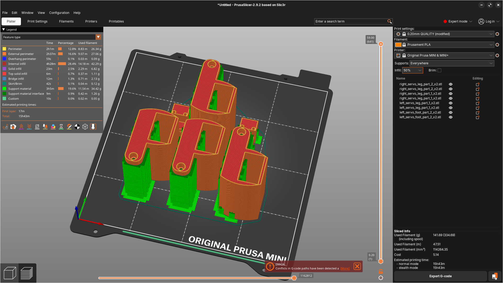
</p>

<p align="center">
  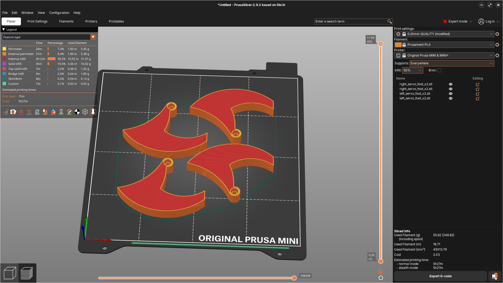
</p>

## Settings
  Layer Height: .2mm \
  Infill: 50% \
  Supports: Everywhere \
  Estimated Printing Time: 36 hours and 31 minutes

## Assembly & Testing

Assembly is one of the trickest parts because everything is so compact and you should be testing the motor limits as you assemble. Here is how I would suggest assembling this walking bot:

1. Screw in the first four motors for the legs as well as the 3D-printed leg parts (without the next four motors). My recommendation on screwing the 3D-printed parts is to physically move the gears so they are at their limits at either position "IN" or "OUT", as described in step 3 below.
2. Label each of the four motors. This will help in the next step, during testing. Below you will see an image for 1 through 4, with one being in the back left, 2 in the front left, and so on.

<p align="center">
  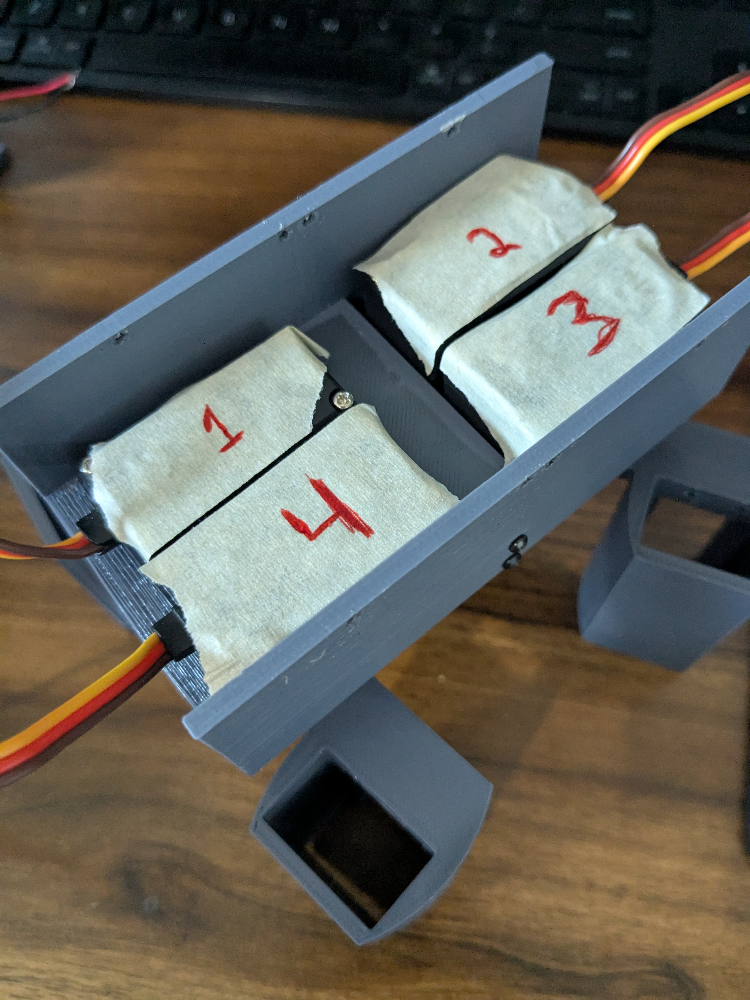
</p>

3. Then, try to control each motor individually and have "IN" and "OUT" positions that are 90 degrees to each other, approximately. It helps to look at the code I have written to make this work with some random equations. In the photo below, the top two motors are in the "IN" position. The "OUT" position is 45 degrees below the position of the bottom two motors.

<p align="center">
  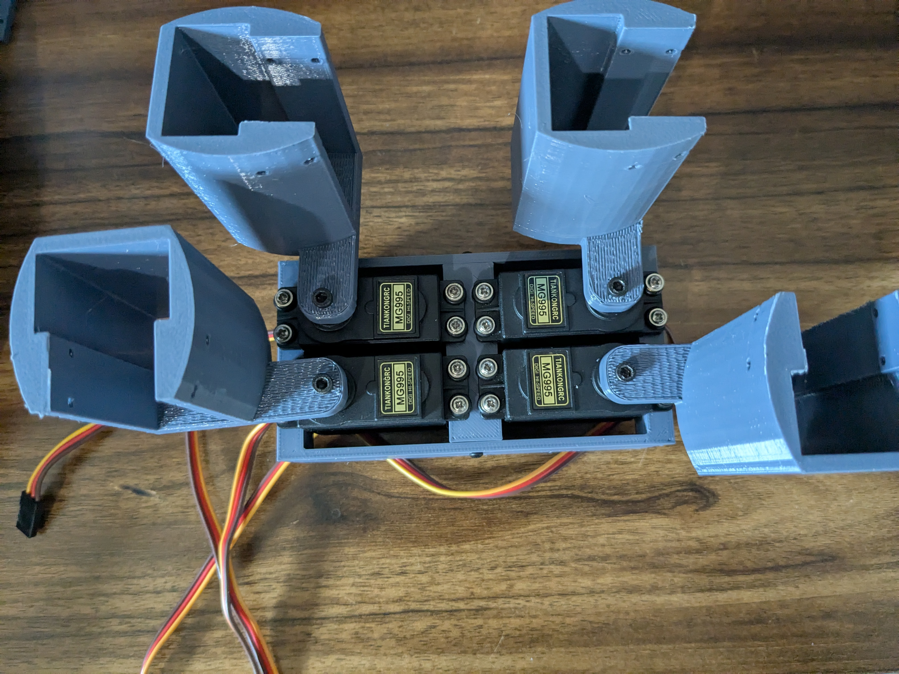
</p>

4. Once the first four motors have been programmed correctly, then attach the following four motors and the feet that go along with them. It also helps to label these motors so programming is easier. You should attach the feet in the same way as the previous parts, physically moving the gear to be at maximum at either the "UP" or "DOWN" position (I tried to do it at the "UP" position). Below you will see what the "DOWN" position ideally looks like.

<p align="center">
  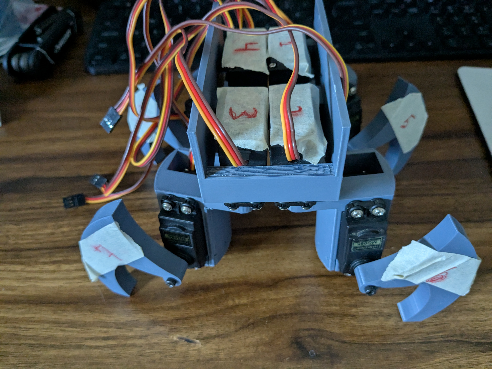
</p>

5. Modify the code as needed to match the "UP" and "DOWN" positions for 90 and 0 degrees, approximately.
6. Once the walking bot's eight motors are ready to go, it's time to add the other parts. I recommend first screwing the PCB onto the PCB holder. Then, screw the base, PCB, and battery holder together -- this might be a bit tricky.
7. Add the battery.
8. Add tape to the cables to keep them out of the way of the walking bot's motion.

That's it!

Here's a video of the walking bot (tethered):

https://github.com/user-attachments/assets/0c37907c-10ff-4d18-97b6-cf6ddd99ad3e

This video can also be found under the media folder.

# Programming

I programmed the walking bot on Thonny. I built some basic functions to create "IN", "OUT", "UP", and "DOWN" positions for the motors. Then, created functions for a walking gait.

## Individual Servo Control

Here is the code that I used to control each servo individually and test them as well:

```bash
# Servo 1 – Rear Right Hip – GPIO 21
servo1 = PWM(Pin(21), freq=50)
def move_servo1(angle):
    angle = max(0, min(180, angle))
    duty = int(30 + (angle / 180) * 75)
    servo1.duty(duty)
```

For each of the motors I also created functions based on the move_servoX(angle), so for servo1, this looks like:

```bash
def servo1_in(): move_servo1(90)
def servo1_out(): move_servo1(0)
```

## Locomotion Functions

After creating all the individual functions, the following were created to move the walking bot:

```bash
def forward_step(delay=0.4):
    servo3_up()
    servo1_up()
    servo4_up()
    sleep(delay)
    servo3_out()
    servo1_out()
    servo4_out()
    sleep(delay)
    servo3_down()
    servo1_down()
    servo4_down()
    sleep(delay)

    servo2_up()
    sleep(delay)
    servo2_out()
    sleep(delay)
    servo2_down()
    sleep(delay)

def backward_step(delay=0.4):
    servo3_up()
    servo1_up()
    servo4_up()
    sleep(delay)
    servo3_in()
    servo1_in()
    servo4_in()
    sleep(delay)
    servo3_down()
    servo1_down()
    servo4_down()
    sleep(delay)

    servo2_up()
    sleep(delay)
    servo2_in()
    sleep(delay)
    servo2_down()
    sleep(delay)

def turn_right(delay=0.4):
    servo3_up()
    servo4_up()
    sleep(delay)
    servo3_out()
    servo4_out()
    sleep(delay)
    servo3_down()
    servo4_down()
    sleep(delay)

    servo1_up()
    servo2_up()
    sleep(delay)
    servo1_in()
    servo2_in()
    sleep(delay)
    servo1_down()
    servo2_down()
    sleep(delay)

def turn_left(delay=0.4):
    servo1_up()
    servo2_up()
    sleep(delay)
    servo1_out()
    servo2_out()
    sleep(delay)
    servo1_down()
    servo2_down()
    sleep(delay)

    servo3_up()
    servo4_up()
    sleep(delay)
    servo3_in()
    servo4_in()
    sleep(delay)
    servo3_down()
    servo4_down()
    sleep(delay)

def stand():
    servo1_in()
    servo2_in()
    servo3_in()
    servo4_in()
    servo5_down()
    servo6_down()
    servo7_down()
    servo8_down()

def collapse():
    servo1_in()
    servo2_in()
    servo3_in()
    servo4_in()
    servo5_up()
    servo6_up()
    servo7_up()
    servo8_up()
```
## Example Code

With those functions, something like this can be used to move the walking bot:

```bash
stand()
sleep(1)
forward_step()
sleep(1)
turn_right()
sleep(1)
backward_step()
sleep(1)
turn_left()
sleep(1)
collapse()
```

# Tips

I don't expect anyone to exactly want to replicate this walking bot; this is mostly for me. However, I do think a lot of things for a build like this are specific to the motors, so that's why it's really important to make sure the orientation of each motor's limit is correct. You can also rewrite the code entirely to your liking or create additional functions. I personally didn't feel the need to create a dedicated class or have a separate file for the code, but others may.
